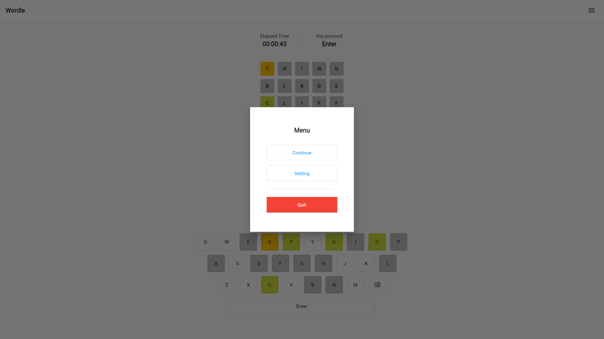

# Wordle

## Description

A wordle game made with Flutter framework.

#### Version

v1.0.0-alpha.2

## Team

| Index | Name      | Github                                        |
| ----- | --------- | --------------------------------------------- |
| 1     | Arvin Lee | [xiaoming857](https://github.com/xiaoming857) |

## Version Detail

| Index | Name    | Version          |
| ----- | ------- | ---------------- |
| 1     | Flutter | Stable - 2.10.04 |
| 2     | Dart    | 2.16.2           |

## How to Run

You can use any web server launcher to launch the application locally. One of the example suggested by [Flutter Documentation](https://docs.flutter.dev/deployment/web) is by using Python:

```bash
python -m http.server 8000
```

## Game Preview

### Main Menu


### Board


### Filled First Row


### Filled All Rows


### Statistics


### Menu


